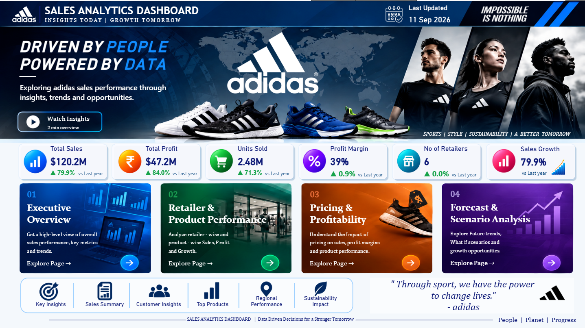

# 👟 Adidas Sales Analytics Dashboard
### *From Raw Sales Data to Actionable Business Insights*

> An end-to-end **Data Analytics & Business Intelligence project** that transforms Adidas sales transaction data into actionable insights using **Python, SQL, PostgreSQL, Power BI, forecasting, and what-if scenario analysis**.

<p align="center">


</p>

---

# 📌 Project Overview

The **Adidas Sales Analytics Dashboard** is an end-to-end analytics project built to transform raw sales transactions into meaningful business insights.

The project covers the complete analytics lifecycle:

- 📥 Raw sales data ingestion
- 🔍 Exploratory Data Analysis (EDA)
- 🧹 Data cleaning and preprocessing
- 🧩 Feature engineering
- 🗄 PostgreSQL database integration
- 📈 SQL-based business analysis
- 📊 Interactive Power BI dashboards
- 🔮 Sales & profit forecasting
- 🎛 What-if price and volume scenario analysis
- 📝 Professional project report
- 🎯 Business presentation and data storytelling

The main goal is to answer four business questions:

> **What happened?**  
> **Who and what is driving performance?**  
> **How profitable is the business?**  
> **What could happen next?**

---

# 🏗 Project Architecture

```text
                         Adidas Sales Data
                                │
                                ▼
                       Excel (.xlsx) Dataset
                                │
                                ▼
                         Python / Pandas
                                │
                 ┌──────────────┴──────────────┐
                 │                             │
                 ▼                             ▼
          Data Inspection              Data Preprocessing
                 │                             │
                 └──────────────┬──────────────┘
                                ▼
                      Feature Engineering
                                │
                                ▼
                         PostgreSQL
                                │
                                ▼
                      SQL Business Analysis
                                │
                                ▼
                         Power BI Model
                                │
                                ▼
                         DAX Measures
                                │
          ┌─────────────────────┼─────────────────────┐
          ▼                     ▼                     ▼
   KPI & Trend Analysis   Retailer & Product   Pricing & Profit
                                │                     │
                                └──────────┬──────────┘
                                           ▼
                                Forecast & Scenarios
                                           │
                                           ▼
                              Business Recommendations
```

---

# 📂 Dataset

The project uses the **Adidas Sales Data** Excel dataset.

### Dataset Summary

| Attribute | Value |
|---|---:|
| Records | **9,648** |
| Original Columns | **14** |
| Date Range | **2020 – 2021** |
| Retailers | **6** |
| Product Categories | **3** |
| Sales Methods | **3** |
| Regions | **5** |
| States | **50** |
| Cities | **52** |

### Dataset Columns

```text
Retailer
Retailer ID
Invoice Date
Region
State
City
Gender Type
Product Category
Price per Unit
Units Sold
Total Sales
Operating Profit
Operating Margin
Sales Method
```

---

# 🛠 Tech Stack

| Category | Technology |
|---|---|
| Programming | Python |
| Data Manipulation | Pandas |
| Numerical Analysis | NumPy |
| Visualization / EDA | Matplotlib, Seaborn |
| Database | PostgreSQL |
| Query Language | SQL |
| Business Intelligence | Power BI |
| Calculations | DAX |
| Source Data | Microsoft Excel |
| Documentation | PDF |
| Presentation | PowerPoint / PDF |

---

# 🚀 Project Workflow

## 📥 1. Data Loading

The raw Excel dataset is imported into Python using Pandas.

```python
import pandas as pd

df = pd.read_excel("./Adidas_Sales_Data.xlsx")
```

Initial checks include:

- Dataset preview
- Dataset shape
- Column names
- Data types
- Descriptive statistics
- Missing values
- Duplicate records

---

## 🔍 2. Exploratory Data Analysis

The preprocessing notebook uses:

```python
df.head()
df.info()
df.describe(include="all")
df.isnull().sum()
```

The EDA stage was used to understand:

- Data structure
- Numerical fields
- Categorical fields
- Date information
- Data quality
- Sales and profit distributions

### Data Quality

The source dataset was validated for missing and duplicate records before further transformation.

---

## 🧹 3. Data Cleaning & Standardization

Column names were standardized to make the data easier to use across Python, SQL and Power BI.

```python
df.columns = df.columns.str.lower()
df.columns = df.columns.str.replace(" ", "_")
```

Examples:

```text
Invoice Date       → invoice_date
Total Sales        → total_sales
Operating Profit   → operating_profit
Product Category   → product_category
```

---

# 📅 4. Feature Engineering

The invoice date was converted into a proper datetime format:

```python
df["invoice_date"] = pd.to_datetime(df["invoice_date"])
```

Additional date features were created:

```text
year
month
day
day_of_week
day_name
week_of_year
quarter
is_weekend
```

These features support:

- Monthly trend analysis
- Year-over-year analysis
- Quarterly analysis
- Weekday/weekend comparisons
- Forecasting

---

# 💰 5. Business Feature Engineering

Additional analytical metrics were created.

### Profit Per Unit

```python
df["profit_per_unit"] = (
    df["operating_profit"] / df["units_sold"]
)
```

### Sales Per Unit

```python
df["sales_per_unit"] = (
    df["total_sales"] / df["units_sold"]
)
```

These features are used to support pricing and profitability analysis.

---

# 🗄 6. PostgreSQL Integration

After preprocessing, the processed dataset is loaded into PostgreSQL.

The workflow is:

```text
Python / Pandas
       ↓
Processed DataFrame
       ↓
SQLAlchemy / psycopg2
       ↓
PostgreSQL
       ↓
SQL Business Analysis
       ↓
Power BI
```

PostgreSQL provides structured storage and allows the cleaned data to be used as a database-backed analytics source.

> **Security:** Database credentials and passwords should never be committed to GitHub.

---

# 📈 7. SQL Business Analysis

SQL is used to answer business questions before and alongside Power BI analysis.

### Example Analysis Areas

- Total Sales
- Total Profit
- Monthly Sales
- Sales by Retailer
- Sales by Product Category
- Sales by Region
- Sales by City
- Sales by Sales Method
- Profitability Analysis
- Product Performance
- Sales Contribution

The SQL script included in the repository is:

```text
Analysis_through_sql.sql
```

---

# 📊 8. Power BI Dashboard

The dashboard is organized into multiple business-focused pages.

### Dashboard Navigation

```text
🏠 Home
   │
   ├── 📈 Executive Overview
   │
   ├── 🏪 Retailer & Product Performance
   │
   ├── 💰 Pricing & Profitability
   │
   └── 🔮 Forecast & Scenario Analysis
```

---

# 🏠 Dashboard Home

The home page works as the main navigation hub.

It provides:

- Overall KPI summary
- Dashboard navigation
- Executive Overview
- Retailer & Product Performance
- Pricing & Profitability
- Forecast & Scenario Analysis
- Project branding and business themes

<p align="center">
  
</p>

---

# 📈 Executive Overview

The Executive Overview gives management a quick view of overall business performance.

### Key KPIs

| KPI | Dashboard Value |
|---|---:|
| Total Sales | **$120.2M** |
| Total Profit | **$47.2M** |
| Units Sold | **2.48M** |
| Profit Margin | **~39%** |
| Number of Retailers | **6** |
| Sales Growth | **79.9%** |

### Visual Analysis

- Monthly Sales Trend
- Sales by Category
- Sales by City
- Sales vs Profit
- Sales Method Performance

<p align="center">
  
</p>

### Key Observations

- Total sales are approximately **$120.17M**.
- Operating profit is approximately **$47.22M**.
- Around **2.48M units** were sold.
- Street Footwear is the highest-selling category.
- Online is the highest-performing sales method.
- New York is the highest-performing city in the dashboard.

---

# 🏪 Retailer & Product Performance

This page answers:

> **“Who drives our sales?”**

### Retailer Ranking

| Retailer | Approx. Sales |
|---|---:|
| West Gear | **$32.4M** |
| Foot Locker | **$29.0M** |
| Sports Direct | **$24.6M** |
| Kohl's | **$13.5M** |
| Walmart | **$10.5M** |
| Amazon | **$10.1M** |

### Product Categories

| Category | Approx. Sales |
|---|---:|
| Street Footwear | **$44.9M** |
| Apparel | **$40.4M** |
| Athletic Footwear | **$34.9M** |

### Interactive Filters

- Year
- Region
- City
- Product Category
- Sales Method

<p align="center">
  
</p>

### Key Insight

The top three retailers contribute roughly **70% of total sales**, highlighting the importance of strategic retailer relationships and revenue diversification.

---

# 💰 Pricing & Profitability

This page answers:

> **“Are we pricing our products correctly?”**

### Visuals

- Price vs Units Sold
- Price vs Profit
- Category Profit Margin
- Profit Per Unit
- Sales vs Profit Margin

### Category Profit Margin

| Category | Approx. Margin |
|---|---:|
| Street Footwear | **40%** |
| Apparel | **40%** |
| Athletic Footwear | **37%** |

<p align="center">
  
</p>

### Business Value

The analysis helps identify:

- High-sales / high-margin products
- High-sales / low-margin products
- Low-sales / high-margin opportunities
- Low-sales / low-margin products
- Price-performance relationships

---

# 🔮 Forecast & Scenario Analysis

This page moves from historical analysis to forward-looking decision support.

### Forecast KPIs

| Metric | Dashboard Value |
|---|---:|
| Forecasted Sales | **$66.2M** |
| Forecasted Sales Growth | **24.0%** |
| Forecasted Profit | **$27.9M** |
| Forecasted Profit Growth | **29.5%** |

<p align="center">
  
</p>

---

# 🎛 What-If Analysis

Power BI What-If parameters were used to simulate changes in business assumptions.

## Price Change Scenario

Example shown in the dashboard:

```text
Price Change = +9%
Estimated Sales ≈ $58.2M
```

## Volume Change Scenario

```text
Volume Change = +10%
Estimated Sales ≈ $58.7M
```

## Combined Scenario

```text
Price Change  = +9%
Volume Change = +10%

Estimated Sales ≈ $63.98M
```

### Why What-If Analysis?

What-if analysis allows decision makers to test different assumptions before implementing pricing or sales strategies.

---

# 📌 Key Business Insights

### 💵 Overall Business Performance

- Total Sales: approximately **$120.17M**
- Operating Profit: approximately **$47.22M**
- Units Sold: approximately **2.48M**
- Overall operating margin: approximately **39.3%**

### 🏪 Retailer Performance

**West Gear** is the largest retailer by sales.

### 👟 Product Performance

**Street Footwear** is the strongest product category by sales and profit contribution.

### 🌎 Regional Performance

The **West** is the highest-performing region in the analysis.

### 🛒 Sales Channel

**Online** is the strongest sales method in the dashboard.

### 📊 Retailer Concentration

The top three retailers represent roughly **70% of total sales**, creating both a strength and a concentration risk.

### 🔮 Future Opportunity

Forecast and scenario analysis provide a framework for evaluating potential sales and profit outcomes under different assumptions.

---

# 🎯 Business Recommendations

### 1. Strengthen Strategic Retailer Relationships

Continue prioritizing high-contributing retailers such as West Gear, Foot Locker and Sports Direct.

### 2. Invest in High-Performing Categories

Maintain strong inventory, marketing and distribution for categories such as Street Footwear.

### 3. Improve Online Performance

Continue developing digital sales channels because Online is the leading sales method in the analysis.

### 4. Investigate Lower-Performing Regions

Study lower-performing regions for product availability, demand, pricing and distribution opportunities.

### 5. Improve Margin Management

Use the pricing and profitability dashboard to identify high-revenue products with weaker margins.

### 6. Use Scenario Planning

Use price and volume what-if parameters before making major commercial decisions.

### 7. Diversify Revenue Sources

Reduce dependency on a small number of major retailers over time by developing additional channels and partnerships.

---

# 📁 Repository Structure

The repository follows this structure:

```text
Adidas-Sales-Analytics/
│
├── 📂 Dashboard/
│   └── Dashboard.pbix
│
├── 📂 Images/
│   ├── dashboard-home.png
│   ├── executive-overview.png
│   ├── retailer-product-performance.png
│   ├── pricing-profitability.png
│   └── forecast-scenario-analysis.png
│
├── 📄 Adidas-Sales-Analytics-Presentation.pdf
├── 📄 Adidas_Sales_Analytics_Project_Report.pdf
├── 📊 Adidas_Sales_Data.xlsx
├── 🐍 Adidas_Sales_Preprocessing.ipynb
├── 🗄 Analysis_through_sql.sql
├── 📜 LICENSE
└── 📘 README.md
```

---

# ▶️ How to Run the Project

## Step 1 — Dataset

Open:

```text
Adidas_Sales_Data.xlsx
```

This is the raw source dataset.

## Step 2 — Python Preprocessing

Open:

```text
Adidas_Sales_Preprocessing.ipynb
```

Run the notebook to perform:

- Data loading
- Data inspection
- Data cleaning
- Date conversion
- Feature engineering
- Database loading

## Step 3 — SQL Analysis

Open:

```text
Analysis_through_sql.sql
```

Execute the SQL queries in PostgreSQL against the processed dataset.

## Step 4 — Power BI

Open:

```text
Dashboard/Dashboard.pbix
```

Refresh the data connection when required.

## Step 5 — Report & Presentation

Review:

```text
Adidas_Sales_Analytics_Project_Report.pdf
Adidas-Sales-Analytics-Presentation.pdf
```

---

# 💡 Example DAX Measures

The Power BI dashboard uses dynamic measures for KPI and scenario calculations.

### Total Sales

```DAX
Total Sales =
SUM(public_customer[total_sales])
```

### Total Profit

```DAX
Total Profit =
SUM(public_customer[operating_profit])
```

### Profit Margin

```DAX
Profit Margin =
DIVIDE(
    [Total Profit],
    [Total Sales]
)
```

The report also includes dynamic calculations for growth, forecasting and what-if scenarios.

---

# 📚 Skills Demonstrated

- ✔ Python
- ✔ Pandas
- ✔ NumPy
- ✔ Data Cleaning
- ✔ Data Wrangling
- ✔ Feature Engineering
- ✔ Exploratory Data Analysis
- ✔ SQL
- ✔ PostgreSQL
- ✔ Database Integration
- ✔ Power BI
- ✔ DAX
- ✔ KPI Development
- ✔ Dashboard Design
- ✔ Forecasting
- ✔ What-If Analysis
- ✔ Business Intelligence
- ✔ Data Storytelling
- ✔ Business Recommendations

---

# 🎓 Learning Outcomes

This project demonstrates the ability to:

- Work with structured sales data
- Perform data quality validation
- Preprocess data using Python
- Engineer analytical features
- Store and query data using PostgreSQL
- Perform business analysis using SQL
- Build interactive Power BI dashboards
- Develop dynamic DAX measures
- Perform pricing and profitability analysis
- Create forecasting and scenario analysis
- Translate data into business recommendations
- Present analytical findings professionally

---

# 🔮 Future Improvements

Potential future enhancements include:

- 🤖 Machine Learning-based sales forecasting
- 📦 Product-level demand prediction
- 🧠 Customer segmentation
- 📦 Inventory optimization
- 💹 Price elasticity analysis
- 🔄 Automated ETL pipeline
- ☁️ Cloud database integration
- 📡 Near-real-time analytics
- 🔌 API-based data ingestion
- 🌐 Streamlit analytics application
- 🔄 Automated Power BI refresh

---

# 👨‍💻 Author

**Enbashakaran**

**Data Analyst | Business Intelligence | Python | SQL | Power BI**

📧 **enbashakaran04@gmail.com**

🔗 [LinkedIn](https://www.linkedin.com/in/enbashakaran-t-0b9940374/)

💻 [GitHub](https://github.com/Enbashakaran-Engineer)

---

# ⭐ Support

If you found this project useful, consider giving the repository a ⭐ on GitHub.

---

## 📜 License

This project is licensed under the **MIT License**.

See the [`LICENSE`](LICENSE) file for details.
